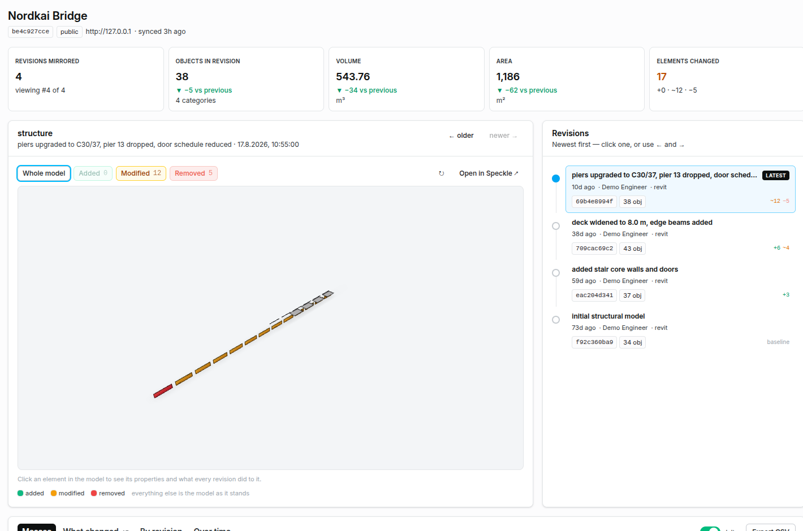
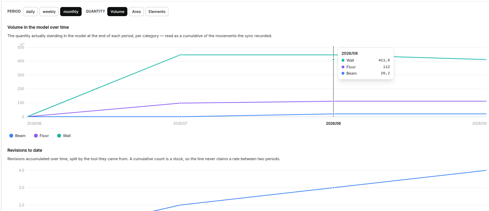
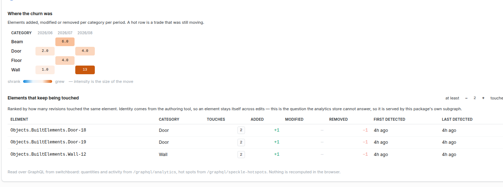
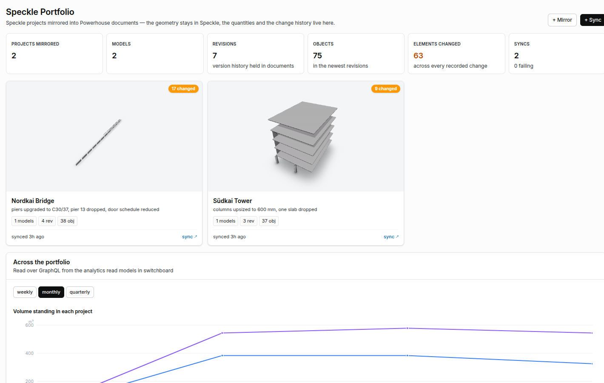
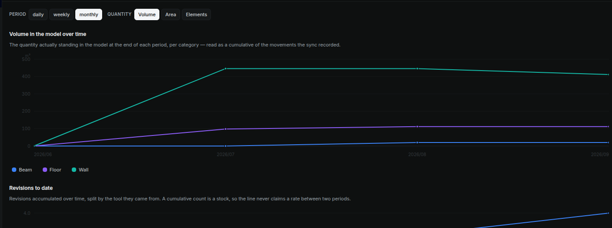
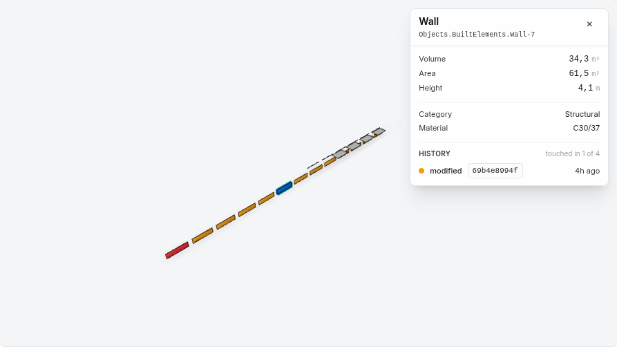

# Speckle × Powerhouse

A Vetra Reactor Package that mirrors a Speckle project into Powerhouse documents:
the geometry stays in Speckle, while the **quantities, the version history and
what changed between revisions** become event-sourced document state you can read,
diff, query and build on.

```
Speckle                          Powerhouse
┌──────────────┐   sync runner   ┌──────────────────────┐
│ project      │ ──────────────▶ │ speckle/sync         │  the job: connection,
│  models      │                 │                      │  options, run history
│  versions    │                 └──────────┬───────────┘
│  object graph│                            │ dispatches
└──────┬───────┘                            ▼
       │  viewer embed             ┌──────────────────────┐
       └─────────────────────────▶ │ speckle/project      │  the mirror: models,
          (3D stays in Speckle)    │                      │  revisions, masses,
                                   └──────────────────────┘  change history
```



## Why mirror instead of query on demand

Speckle already stores the model and draws it well; there is no point copying
either. What Speckle does *not* keep is an auditable record of what a revision
meant for the numbers — how much concrete the deck gained, which 12 piers were
re-specified, when anyone noticed. That record is what the mirror holds, and
because it is an event-sourced Powerhouse document it is:

- **diffable** — every revision's per-category totals are state, so any two are
  comparable without re-walking Speckle,
- **attributable** — each write is an operation with an index, a timestamp and a
  hash,
- **queryable** — the document is exposed over GraphQL by Switchboard, so cost,
  procurement or reporting documents can reference it,
- **offline** — the numbers survive Speckle being unreachable.

## What is in the package

### Document models

| Model | Type | What it holds |
| --- | --- | --- |
| **Speckle Sync** | `speckle/sync` | The sync job: server URL, project id, target mirror, depth options, and one `SyncRun` per attempt. The collaborator's Speckle token lives in **local scope**, private per user. |
| **Speckle Project** | `speckle/project` | The mirror: models, revisions (with per-category masses), and a change entry per revision pair. Every write is an upsert keyed on the Speckle id, so a re-sync is idempotent. |

Both are at 100 % reducer coverage on lines, branches, functions and statements.

### Processor

`processors/speckle-sync-runner` reacts to a `REQUEST_SYNC` operation, walks the
Speckle graph and dispatches the results into the mirror document.

Its interesting part is `engine.ts`, which is pure and unit-tested:

- **`summariseByType`** totals volume, area and length per category. It reads the
  two shapes exporters actually produce: the Speckle connectors write `volume` at
  the top level, while an IFC import nests the same fact under
  `properties.Quantities.BaseQuantities` as `NetVolume`, wrapped as
  `{ name, units, value }` with the unit spelled out ("Cubic Metre"). It also
  groups on `ifcType` where there is one — an IFC import types every object
  `Objects.Data.DataObject`, so grouping on the Speckle type alone collapses a
  whole building into one bucket.
- **`isElement`** keeps spatial structure and raw geometry out of the totals. An
  IFC file is organised as site → building → storey → space, and those carry
  quantities of their own: adding a room's air to the concrete in the walls
  produces a number that means nothing. Display meshes are excluded for the same
  reason — they are the same material counted twice.
- **`diffGraphs`** diffs on `applicationId` — the authoring tool's own element id
  — rather than on the Speckle object id, which is a content hash. Diffing on the
  hash alone would report every edited wall as one deletion plus one addition;
  keying on `applicationId` makes it a **modification**, which is what actually
  happened.
- **`categoryDeltas`** reports only the categories that moved.

A `synced_version` table in the processor's relational namespace records what has
already been pulled, so a repeated sync skips revisions it has seen.

### Editors

| Editor | For | What it does |
| --- | --- | --- |
| **Model Explorer** | `speckle/project` | The 3D model, a revision timeline you step with ← / →, per-category masses with deltas against the previous revision, an element-level change panel, and trend charts across the history. Added elements are painted green, modified amber, removed red; *Added* / *Modified* / *Removed* brings one category forward and ghosts the rest. |
| **Sync Console** | `speckle/sync` | Connection, a live *Check Speckle* probe, the token (local scope), depth options, the run trigger and the full run history. |
| **Speckle Workspace** | drive app | Every mirror on the drive as a card with Speckle's own preview thumbnail, drive-wide totals, and one merged feed of every model change across projects. Owning the drive surface, it also routes a selected document to its own editor. |

### Analytics

A **Speckle Analytics** processor runs in switchboard only and derives read models
from the mirror documents' own state:

- per period and category: `Volume`, `Area`, `Length`, `Elements` — written as
  *movements*, so the analytics engine's cumulative reading gives the quantity
  actually standing in the model;
- per period: `Revisions`, split by authoring tool and author;
- per period and category: `Added`, `Modified`, `Removed`;
- `Truncated`, so no chart presents a capped read as complete;
- and one element-granular table behind this package's own
  `speckle-hotspots` subgraph.

Editors read all of it over GraphQL — `/graphql/analytics` for the series,
`/graphql/speckle-hotspots` for the rankings. Nothing is recomputed in the
browser. Warm queries land in **11–22 ms**, and their cost scales with periods ×
categories rather than with object count.

The Model Explorer's *Over time* tab shows quantity development on a calendar
axis, model activity by tool, a category × period churn heatmap, and the
elements that keep being touched. The drive app adds the portfolio view across
projects.







Element hot spots need the identity that survives an edit, which is why
`RECORD_CHANGE` stores `touchedElements` carrying the authoring tool's own id
rather than only the Speckle object hashes. Everything is therefore rebuildable
from the documents alone, with no call back to Speckle.

### Charts from the document alone

The *Trends* tab plots the mass of each Speckle category across the revision
history, for any of count / volume / area / length, plus how many elements were
added, modified and removed at each step. Both are pure functions of the mirror
document: it already holds every revision with its per-category totals and every
change entry with its deltas.

These need no processor at all: the series is a few dozen points and it is
already in the document the editor has open. That is the dividing line — a read
model earns its place when the question spans documents (the portfolio view), or
needs an axis the document does not carry (calendar time), or needs a ranking
(hot spots). The *By revision* tab needs none of the three, so it stays a pure
function of the open document and keeps working with switchboard unreachable.

Every surface follows the viewer's theme:



All charts are hand-drawn SVG in `editors/shared/charts.tsx`: no chart
dependency, and full control of dark mode. One `ChartFrame` owns measurement,
axes on round numbers, the hover guide, the tooltip and the interactive legend;
`LineChart` and `StackedBarChart` only describe their marks. Both the
document-derived series and the analytics series render through it — an area
chart and a bar chart therefore look like the same product, and there is no
second implementation of any of it.

Geometry that can be wrong lives in `chart-model.ts` and is unit tested: which
period the pointer is over, where a band's top sits, what a readable axis looks
like, and trimming the padding periods a query window adds.

Quantities are drawn as unstacked lines, so each category reads as its own
number and they can be compared directly — the axis is then bounded by the
largest single series rather than by the period totals, which uses more of the
plot. Counts are drawn as stacked bars, where the total does mean something. The
churn bars use the
same green, amber and red the 3D view paints with — so a tall amber bar and the
amber elements in the model read as one fact.

### Why the viewer runs here rather than in an iframe

Painting elements by what happened to them needs `FilteringExtension`, and the
hosted Speckle embed cannot be driven from a host page at all — it has no
`postMessage` listener, and its URL carries no colouring or filtering. So the
Model Explorer runs `@speckle/viewer` itself and calls `setUserObjectColors`.

The trade is deliberate: a dependency on three.js and on viewer lifecycle, in
exchange for the picture being a function of document state. *Open in Speckle*
stays one click away, and with a category picked it deep-links to exactly those
objects, so nothing is lost.



Clicking an element opens a details panel: the properties the authoring tool
wrote — quantities with the right unit for each dimension, category, material —
and then the part a viewer cannot produce on its own, every revision that touched
that element, read from the mirrored diff. Element identity comes from
`applicationId`, so the history follows an element across edits that change its
Speckle hash. A click usually lands on the display mesh, so the panel walks up to
the nearest ancestor that carries an `applicationId`.

Removed elements are not in the selected revision, so they are loaded
individually by object id — Speckle objects are content-addressed and stay
reachable after the revision that dropped them. That is one request per element,
so it is capped, and the view says when it truncated.

### Two things the run log exists for

A run that the runner never picks up would otherwise leave the document stuck in
`REQUESTED` forever, so **Cancel run** abandons it (recorded as `CANCELLED`, with
a reason) and returns the document to `IDLE`. And because the runner keeps a
cache of the revisions it believes it has already pulled, **Full resync** ignores
that cache and walks every revision again — the way back if a previous run's
writes did not land.

## Running it

```bash
ph vetra --dev            # Vetra Studio + local Switchboard
npm run tsc              # types
npm run lint:fix         # oxlint, type-aware
npm run test:coverage    # reducers must stay ≥95 % on every metric
```

Then, in Vetra Studio:

1. Open the drive — the **Speckle Workspace** drive app is the entry point.
2. **+ Mirror** creates a `speckle/project` document, **+ Sync** a `speckle/sync`.
3. In the Sync Console: set the server URL and project id, hit **Check Speckle**
   to confirm they resolve, pick the mirror as the target, then **Run sync**.
4. Open the mirror. Step the timeline with ← / →.

### Everything in Docker

`ph vetra` is the way to develop; `docker compose` is the way to *run* the whole
thing on one machine — Speckle, Postgres, Redis, MinIO, and this package's
Switchboard and Connect.

```bash
./start.sh              # build, start, wait for health, print the URLs
./start.sh --no-build   # start what is already built
./start.sh --rebuild    # rebuild the two images without the layer cache
./start.sh --debug      # also start maildev, to read Speckle's outgoing mail
./start.sh --down       # stop, keep the volumes
./start.sh --down-all   # stop and delete the volumes
```

| | |
|---|---|
| Speckle | `http://127.0.0.1` |
| Connect | `http://localhost:3000` |
| Switchboard | `http://localhost:4001` — `/graphql`, `/graphql/analytics`, `/mcp` |
| Postgres | `localhost:5432`, databases `speckle` and `powerhouse` |

Two things the script cannot do for you: register the first Speckle account, and
create a personal access token for it (`streams:read`, `users:read`) to put in
`.env` as `SPECKLE_TOKEN`. Until then the runner can only read public projects.

Every host port comes from `.env` (copied from `.env.example` on first run).
Speckle is the reason that matters: it serves its own origin to the browser, so
`SPECKLE_PORT` and `SPECKLE_ORIGIN` must agree — the script refuses to start if
they do not, because the failure is otherwise silent until the frontend calls a
server that is not there. If you already run a standalone Speckle stack, it holds
80, 5432, 6379 and 9000; the script names the container that holds each port
rather than letting the bind fail.

The Speckle in this stack starts **empty**. Projects you mirrored into a
different Speckle instance live in that instance's volumes, not here.

Two notes on how the images are built, both of which cost an afternoon to learn:

- `./Dockerfile` is the boilerplate for a *published* package (`ph init` +
  `ph install <name>`), and CI builds it. It cannot build this repo — its local
  fallback copies `package.json` and never the source. `docker/Dockerfile.local`
  builds the working tree instead, with a `switchboard` and a `connect` target.
- The reactor loads a package by importing `<name>/document-models`,
  `<name>/subgraphs` and `<name>/processors`. Those subpaths exist only in
  `package.json`'s `exports`, and Node applies an `exports` map only to *bare*
  specifiers — never to a path. So the project directory can never load under
  plain node: `import("/app/document-models")` fails with
  `ERR_UNSUPPORTED_DIR_IMPORT`, every loader gives up, and the switchboard boots
  serving nothing, without an error. The image therefore runs `ph build` and
  links the package into `node_modules` under its own name, then loads it via
  `PH_PACKAGES`. The build asserts that all three subpaths resolve, so this
  fails loudly at build time rather than quietly at boot.

### Credentials

The token in the Sync Console lives in the document's **local scope**: private to
the collaborator who entered it, never replicated to others, and used only for
the live checks in that editor. The background runner authenticates with
`SPECKLE_TOKEN` from the reactor's environment — a service credential — or
unauthenticated for public projects. It never reads a collaborator's token.

Local scope is appropriate for a trusted internal drive. A production deployment
should move to OAuth or a dedicated secret store.

## Notes for anyone extending this package

- A **drive app** is a `powerhouse/app` document, not a `powerhouse/document-editor`
  one, and its scaffold is generated into `editors/<name>/`, not `apps/`. An editor
  document pointed at `powerhouse/document-drive` produces nothing usable.
- Connect selects the drive app from the drive header's `meta.preferredEditor`.
  `addDrive` over MCP accepts a `preferredEditor` field and a name and applies
  **neither** — the drive comes back with `meta: {}` and an empty name, and
  Connect silently falls back to "Drive Explorer App". Set them afterwards: the
  `setPreferredEditor` mutation on `/graphql/r` (its result type is `PHDocument`,
  which has no `header` field — select `preferredEditor` directly), and a
  `SET_DRIVE_NAME` action for the name.
  `addDrive`'s `preferredEditor` argument does not set it; the Switchboard
  mutation `setPreferredEditor(documentIdentifier:, preferredEditor:)` does.
- Once a drive app is active it owns the document routes too, so it has to render
  the editor for a selected file itself — see `SelectedDocumentEditor` in
  `editors/speckle-workspace/editor.tsx`.
- A processor is registered when the reactor starts. Generating one does not
  register it in a running reactor: restart `ph vetra` before expecting it to
  react.
- An action's `timestampUtcMs` is parsed as an **ISO date string**, despite the
  name. Epoch milliseconds are rejected.
- The viewer's `#embed=` hash accepts **only** the eight boolean flags in
  `EmbedOptions` (`isEnabled`, `isTransparent`, `hideControls`,
  `hideSelectionInfo`, `disableModelLink`, `noScroll`, `manualLoad`,
  `hideSpeckleBranding`). Any other key invalidates the whole object and the
  viewer silently falls back to a non-embedded view — which looks exactly like
  "the setting was ignored".
- Viewer filter state is **not** URL-driven at all. The only way a URL can target
  objects is the resource string after `/models/`: a comma-separated list whose
  parts are `all`, a model id, `modelId@versionId`, `$folder`, or — decided purely
  by being 32 characters long — a raw object id.
- `SpeckleLoader` takes the *legacy* URL shape
  `<host>/streams/<projectId>/objects/<objectId>`; a `/projects/...` URL throws
  `Unexpected object url format`.
- `Viewer.init()` sizes the renderer from the container, so a container that gets
  its height from an aspect ratio must be followed by `viewer.resize()` — without
  it the canvas is 0×0 and draws nothing while reporting no error.
- An analytics processor factory is called **once per drive**. A processor that
  subscribes to documents by type rather than by drive must therefore register
  itself only once, or several instances will rebuild the same read model and
  interleave one instance's delete with another's insert.
- `clearSeriesBySource` returns the driver's result object, not a row count.
- The analytics engine reports two numbers per row: `value`, the movement within
  the period, and `sum`, the running cumulative. There is no `avg`, `count`,
  `having` or ordering by an aggregate — which is why rankings need SQL.
- `Viewer.dispose()` does not remove its canvas from the DOM. Under React's
  development double-mount that leaves a dead canvas stacked under the live one,
  so the container is cleared explicitly on cleanup.

## Layout

```
document-models/
  speckle-sync/           the sync job
  speckle-project/        the mirror
processors/
  speckle-analytics/        analytics + hot-spot read models (switchboard only)
    series.ts              pure: state -> series records        (16 unit tests)
  speckle-sync-runner/
    engine.ts             pure: totals + diff        (21 unit tests)
    processor.ts          reacts to REQUEST_SYNC, dispatches into the mirror
editors/
  shared/                 formatting, UI primitives, Speckle client
  model-explorer/         3D + revisions + masses + changes + trends
  sync-console/           connection, token, trigger, run log
  speckle-workspace/      drive app
```
